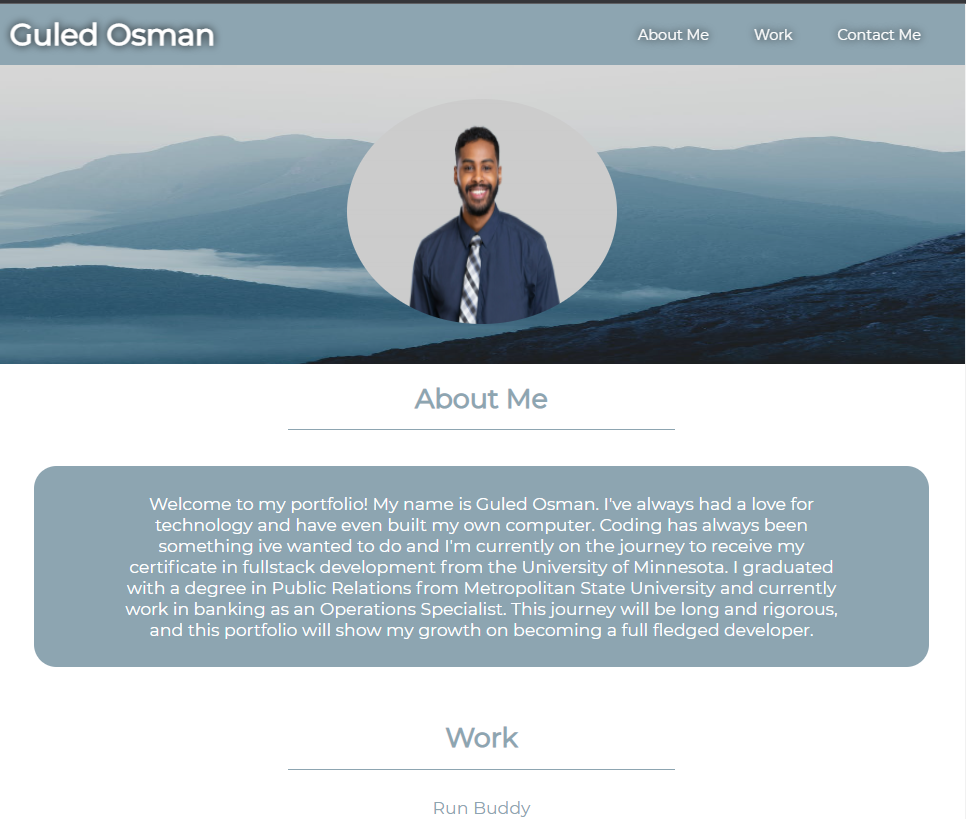

## My Professional Portfolio

## The Motivation

My motivation for this project is to highlight projects that Im proud of and give a glimpse of who I am personally and professionally. Also, its to be able to put myself out there and have communcation with people who are interested in my work.

## Challenges

The main issue I dealt with on this challenge was getting the flexbox to act as intended and flexing in relation to the screensize. Another learning curve was to keep my profile image on top of my mountain background. This project really developed my growth within CSS and using a lot of different style options has made me realize what is truly possible with this one tool.

## Screenshot

## Link
https://itzguled.github.io/portfolio/

